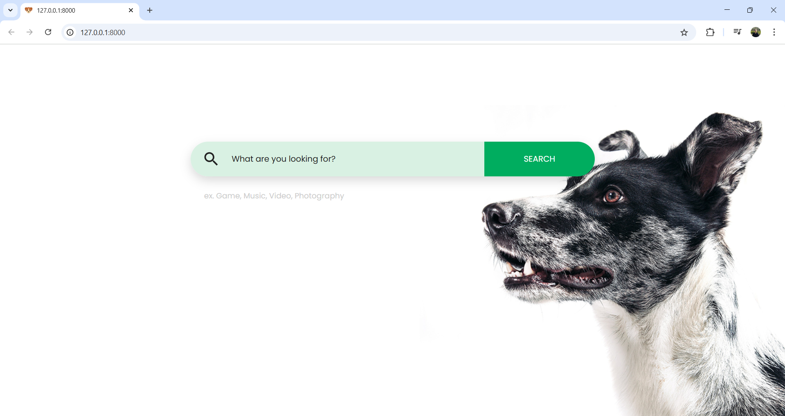

# 🔍 Dog Search Engine

A full-stack search engine that combines **web crawling**, **machine learning**, and **Django** to deliver categorized, relevant results related to dogs from across the internet.

> 📌 *Originally developed between **July – August 2022** during my studies, this was one of my first full-stack and ML-integrated projects. It helped me deeply understand how search engines work under the hood — from data collection to classification.*

---

## 🚀 Features

- 🧵 **Multi-threaded Web Crawler** (optional): Extracts content from various dog-related web pages.
- 🧠 **ML-Based Relevance Filtering**: Uses `OneClassSVM` to filter out irrelevant content.
- 📚 **Categorization**: Applies `MultinomialNB` to classify pages into 7 categories.
- 🌐 **Django Web App**: Fully functional frontend and backend.
- 🗃️ **MySQL Integration**: Efficiently stores and manages crawled data.

---

## ⚙️ Project Structure
```
dog-search-engine/
├── search/ # Django app logic
├── SearchEngine/ # Django project settings
├── templates/ # HTML templates
├── manage.py
├── trainData_v2.csv # CSV for training the classifier
└── README.md
```

---

## ▶️ Getting Started

### 1. Clone the Repository

```bash
git clone https://github.com/your-username/dog-search-engine.git
cd dog-search-engine
```
### 2. Install Dependencies

It's recommended to use a virtual environment.


### 3. Set Up the Database
Make sure to update your DB credentials in `settings.py`:
```bash
DATABASES = {
    'default': {
        'ENGINE': 'django.db.backends.mysql',
        'NAME': 'search',
        'USER': 'youruser',
        'PASSWORD': 'yourpassword',
        'HOST': 'localhost',
        'PORT': '3306',
    }
}
```

You don’t need to manually handle migrations — the project includes a script.

🧾 Option A: Run the Django Migration Code
Migration logic is handled internally by the app.

🧾 Option B: Run Migration Manually (if needed)
```bash
python manage.py makemigrations
python manage.py migrate
Make sure to update your DB credentials in settings.py.
```

---

## 🧵 Optional: Using the Web Crawler
By default, the crawler thread is commented out to avoid unnecessary crawling during normal usage.

If you want to use the crawler:

Uncomment the following code block in search/views.py or equivalent:


Insert a seed URL into the database manually:

```sql

-- Insert a website to start crawling from
INSERT INTO unvisitedwebsites (url, status)
VALUES ('https://example.com/dog-articles', 'pending');
```
Then, run app normally:

---

## 🧠 ML Details
-**Relevance Detection**: OneClassSVM filters relevant pages.

-**Text Classification**: Multinomial Naive Bayes classifies pages into:

        Artificial Intelligence, Graphical visualization, Software Engineering, Architecture And OS, Network, Database, Data Structure And Algorithm

-**TF-IDF** is used for vectorization.

-**NLTK** is used for tokenization, finding synonyms, and identifying stopwords.

---

## 💾 MySQL Configuration
Example `settings.py` DB block:

```python

DATABASES = {
    'default': {
        'ENGINE': 'django.db.backends.mysql',
        'NAME': 'search',
        'USER': 'youruser',
        'PASSWORD': 'yourpassword',
        'HOST': 'localhost',
        'PORT': '3306',
    }
}
```
Run migrations and you're ready.

## 📌 Future Enhancements
-Use pre-trained models (BERT for text)

-Add a background scheduler for auto-crawling

-Deploy online via AWS, Heroku, or Railway

## 👤 Author
Alireza Kalantarhormozi<br/> 
GitHub: @alirezakalantarhormozi
